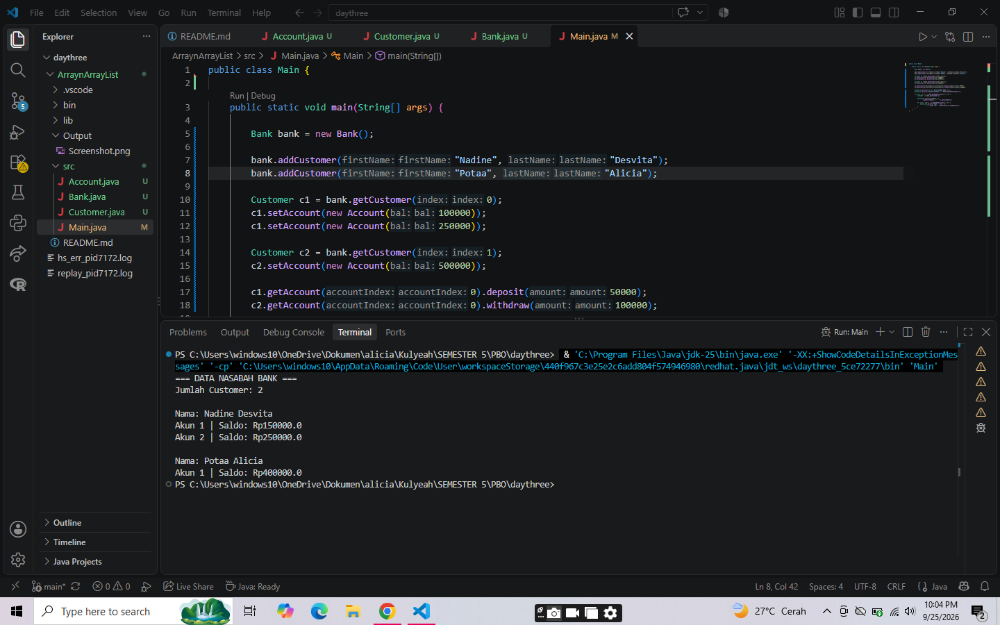

# Latihan Array dan ArrayList

## Struktur Program

- `Account.java`
- `Customer.java`
- `Bank.java`
- `Main.java`

## Konsep yang Digunakan

### 1. Array

Program menggunakan array untuk menyimpan beberapa objek.

Contoh pada `Customer.java`:

```java
private Account[] accounts = new Account[5];
```

Array memiliki ukuran tetap sebanyak 5 akun sesuai latihan pada slide.

### 2. Operasi Array

Beberapa operasi yang digunakan:

- Menambahkan objek ke array.
- Mengakses objek berdasarkan indeks.
- Menghitung jumlah objek dengan variabel `numberOfAccounts`.

### 3. Eksplorasi Main

Pada `Main.java` dilakukan:

- Membuat objek `Bank`.
- Menambahkan customer.
- Menambahkan beberapa account.
- Melakukan `deposit()` dan `withdraw()`.
- Menampilkan seluruh data customer beserta saldo setiap account.

## Library Tambahan

Tidak menggunakan library eksternal.

## Screenshot

Berikut hasil ketika program dijalankan.

